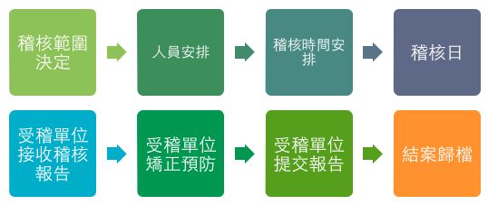

個資稽核系統 Personal Infomation Audition System (PIA)
==================================

## 目錄

 1. [簡述](#簡述)
 2. [專題研究動機與目的](#專題研究動機與目的)
 3. [專題重要貢獻](#專題重要貢獻)
 4. [團隊合作方式](#團隊合作方式)
 5. [設計原理、研究方法與步驟](#設計原理、研究方法與步驟)
 6. [系統實作與實驗](#系統實作與實驗)
 7. [安裝、部署](#安裝、部署)
 8. [參考資料](#參考資料)

## 簡述

在現在資訊網路已成人們生活中隨處可見的工具，但也衍生出個人資訊洩漏的問題，因而有了「個人資料保護法」，讓公司行號、政府機構在蒐集、擁有個人資料時更多了「保護資料」的基本義務。本校擁有大量之個資，為了確保本校確實保護好這些資料，目前已經建置並導入個資管理系統 (Personal Infomation Management System)，作為個資盤點以及風險評估之用；但各個單位之個資保管需要藉由稽核的方式來確保個資保管恰當，因此本校組織了一個稽核小組來對各個單位進行稽核。  

對於稽核小組在稽核進行時，需要到本校各個單位進行稽核任務，本校有大量單位需要稽核，因此在進行時需要排程進行，並搭配書面資料作為通知以及意見的交換，大量書面資料之整理、傳遞造成的麻煩，會導致稽核小組工作量龐大，因此計畫製作一個線上「個資稽核系統」 (Personal Infomation Audition System) 的網頁服務來幫助稽核流程之進行。  

本專題係研究開發此「個資稽核系統」 (Personal Infomation Audition System) ，把完整之個資稽核流程電子化，利用線上網頁進行個資任務排程規劃、填寫稽核結果以及檢討報告，並配合電子郵件來進行通知以及確認簽署。

## 專題研究動機與目的

本專題以 Web 為基礎，Client-Server 為架構，使得本服務有雲端之「隨時可存取」特性，而非一本地端之應用程式，所有使用者只需瀏覽器即可操作，我們研究撰寫在伺服器端運作的 PHP 腳本程式加上資料庫來進行邏輯判斷以及流程運作 (接近俗稱的 LAMP)，並且採用 Laravel 作為框架來進行開發，達成稽核流程 (流程如下) 所需之所有功能以及流程之運作。



本專題需要研究使用的功能有：

 1. 身份驗證以及登入 - 資料庫存取、 Session 以及存取控管
 2. 管理介面 - 使用者、設定、任務管理
 3. 稽核人員介面 - 稽核行事曆、稽核報告填寫
 4. 稽核以及矯正預防報告產生 - PDF 產生器
 5. 單位主管通知簽署 - 藉由信件寄送簽署連結以及稽核報告 PDF 給單位主管確認
 6. 受稽單位介面 - 受稽行事曆、矯正預防報告填寫

## 專題重要貢獻

本專題為繼個資管理系統架設完畢之後，更進一步對校內各個單位進行稽核之電子線上化輔助工具，藉由本專題之成果，使得：

 1. 稽核人員可在線上填寫稽核報告
 2. 受稽單位可在線上接受到稽核報告
 3. 權責單位主管可線上簽核
 4. 矯正預防措施可以在線上填寫完成
 5. 由相關人員進行追蹤

預期達成效益：  

 1. 簡化紙本文書的資源
 2. 時間效率上可以掌握
 3. 可以事後查詢與追查
 4. 稽核人員可即時記錄
 5. 受稽單位可減輕負擔

## 團隊合作方式

本專題由 王丕中 教授指導

 * 資工三 邱冠喻
 * 資工三 鍾婉婷
 * 資工三 吳信億

三人進行

 * 資料庫 Schema 設計
 * 系統架構設計
 * 程式撰寫
 * 系統測試
 * 報告撰寫

並且透過 Git 進行程式版本管理以及同步程式碼

## 設計原理、研究方法與步驟

### 系統介紹

個資稽核系統是對個人資料處理作業是否符合個人資料管理制度所進行之稽核作業的線上系統，可簡化紙本文書的資源，並利用易操作的網頁介面協助簡化個資稽核的流程，讓人員能快速的新增、修改以及查詢稽核的狀況，此外也能以pdf的格式匯出保存，還能即時以電子郵件通知相關單位稽核之進度。

### 設計原理

利用HTML之網頁技術，和Bootstrap、jQuery等前端技術打造現代化的網頁，並以Laravel這一強健的PHP框架構築後端，簡化系統之開發流程。Bootstrap提供許多現成的元件用來組裝網頁，jQuery則能讓網頁呈現出動態的效果，變得更加栩栩如生，Laravel則為MySQL資料庫的存取提供了一套標凖的介面，利用composer﹙PHP依賴性管理工具）及撰寫migration檔案更能加快部署系統。

### 技術介紹

#### Bootstrap

Bootstrap是一現代的網頁前端框架，包含HTML、CSS及javascript，並提供強大的網格系統以及響應式設計，強化行動裝置使用者的體驗，Bootstrap甚至曾拿下Github排名第一，可見其受歡迎之程度。 

#### jQuery

jQuery是最知名的javascript函式庫，提供了相當簡潔的介面用來撰寫網頁的動畫效果、事件處理以及AJAX之操作。

#### Laravel

 Laravel是一個開源的PHP網頁應用程式框架，可用來開發MVC架構之網頁應用，Laravel提供許多方便的功能，如

 * Eloquent ORM：能將資料庫內的表視為如同物件的類別，row則如同一個個的變數instance般，提供程式員以最熟悉的物件導向方式操作資料庫的資料。
 * Query builder：隱藏原始的SQL語句，將其融入PHP語言，提供比ORM更加直接的操作。
 * routing：定義連結和路徑的關係，更能動態的改變實體連結，以因應路由的變動。
 * RESTful：REST是一主流的web服務實現方案，其模式更加簡潔，可分割同一url下不同http方法（如GET、POST）之邏輯。
 * 表單:對表單輸入的處理，以及輸入的自動驗證等等。

#### Composer

Composer是一個PHP的依賴性管理工具。可透過命令列介面加入、安裝及更新專案所需的依賴函式庫，大幅簡化部署開發環境的複雜步驟。

#### Git/Github

Git是一個分散式版本控制軟體，很多著名的軟體都使用Git進行版本控制，Git最為出色的是它的合併追蹤（merge tracing）能力。
GitHub是一個共享虛擬主機服務，用於存放使用Git版本控制的軟體代碼和內容專案，它也提供了一些方便社會化軟體開發的功能，包括允許用戶跟蹤其他用戶、組織、軟體庫的動態，對軟體代碼的改動和bug提出評論等。

## 系統實作與實驗

## 安裝、部署

#### 需求

 * 建議使用 Linux 作業系統，本專案以 `CentOS 6.5` 開發
 * 需要之軟體：
    * Apache / Nginx 等 HTTP 網頁伺服器軟體
    * PHP 5.4 以後之版本，並有 Extension: cli pdo mysqlnd mbstring mcrypt
        * 如果 HTTP 伺服器軟體使用的是 Nginx ，則還需要 PHP-fpm
    * 資料庫管理程式如 MySQL / PostgreSQL / Sqlite
    * wkhtmltopdf
 * 如果使用之系統為 `CentOS 6.5`，可以直接執行下方 Shell script 來完成上方軟體之安裝
    * `sys_setup/setup_cli.sh`
    * `sys_setup/setup_web_server.sh`
    * `sys_setup/wkhtml2pdf.sh`
    * 把本專案放置在 `/var/pia`

#### 安裝部署程序

- 取得本專案程式碼
    - 使用 Git： `git clone <本專案git位址>`
    - 或者其他管道例如解壓縮檔案
- 移動本專案至 HTTP 伺服器目錄之下，並將網路伺服器設定根目錄到本專案的public資料夾。
- 執行終端指令 `composer update` ，更新vendor (PHP/Laravel 相依套件)，詳細請參照 [Composer](https://getcomposer.org/) 的說明文件。
- 建立資料庫以及有效之使用者
- 複製設定示範檔案至正式設定檔：

  ```
  cp app/config/database.example.php app/config/database.php
  cp app/config/mail.example.php app/config/mail.php
  ```

- 編輯 `app/config/database.php` ，修改資料庫連線參數。
- 編輯 `app/config/mail.php` ，修改信件寄送參數。
- 執行終端指令 `php artisan migrate` ，建立資料表 Schema
    - 可以事先把 `PIMS` 之使用者、單位資料表匯入至資料庫，在 migration 執行時會詢問是否要從指定資料表匯入使用者與單位，以及設定全站設定值
    - 會自動建立一預設管理員，帳號密碼皆為 `admin` 
- 啟動 HTTP server
- 編輯 `app/config/app.php` ，將 `debug` 參數改為 `false` 並且依據需求修改各項選項。
- 使用瀏覽器開始使用 PIAS ，登入管理員並修改管理員帳號密碼，便可開始使用。

#### 開發環境

如需加入、修改本專案之功能，有些建議之環境設定

- 使用 `Sqlite` 作為測試資料庫即可
- 可以使用 vagrant 或者 docker 來進行環境的建立 (本專案有附上 `Vagrantfile` / `Dockerfile`)

本專題使用基於 `Laravel 4.2` 撰寫，[請詳閱參考文件](http://laravel.tw/docs/4.2)

## 參考資料

 * [Laravel](http://laravel.tw/)
