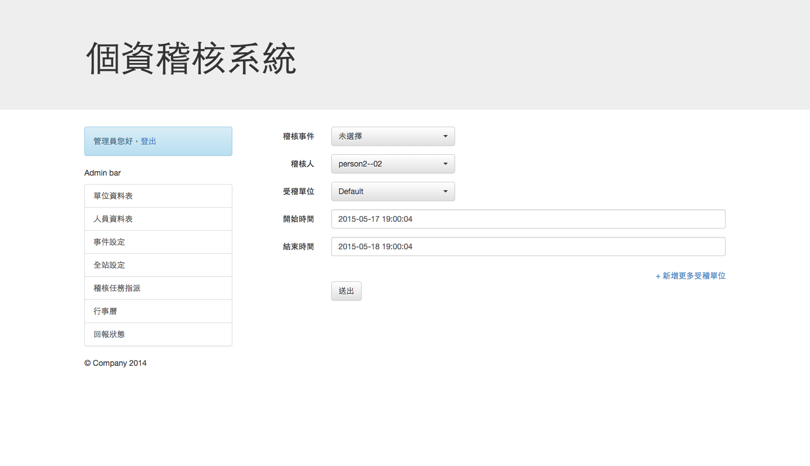
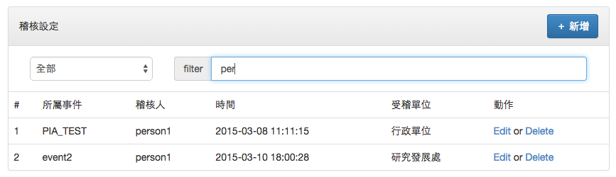

個資稽核系統 Personal Infomation Audition System (PIA)
==================================

## 目錄

 1. [簡述](#簡述)
 2. [專題研究動機與目的](#專題研究動機與目的)
 3. [專題重要貢獻](#專題重要貢獻)
 4. [團隊合作方式](#團隊合作方式)
 5. [設計原理、研究方法與步驟](#設計原理研究方法與步驟)
 6. [系統實作與實驗](#系統實作與實驗)
 7. [功能介紹](#功能介紹)
 8. [安裝、部署](#安裝部署)
 9. [參考資料](#參考資料)

## 簡述

在現在資訊網路已成人們生活中隨處可見的工具，但也衍生出個人資訊洩漏的問題，因而有了「個人資料保護法」，讓公司行號、政府機構在蒐集、擁有個人資料時更多了「保護資料」的基本義務。本校擁有大量之個資，為了確保本校確實保護好這些資料，目前已經建置並導入個資管理系統 (Personal Infomation Management System)，作為個資盤點以及風險評估之用；但各個單位之個資保管需要藉由稽核的方式來確保個資保管恰當，因此本校組織了一個稽核小組來對各個單位進行稽核。

對於稽核小組在稽核進行時，需要到本校各個單位進行稽核任務，本校有大量單位需要稽核，因此在進行時需要排程進行，並搭配書面資料作為通知以及意見的交換，大量書面資料之整理、傳遞造成的麻煩，會導致稽核小組工作量龐大，因此計畫製作一個線上「個資稽核系統」 (Personal Infomation Audition System) 的網頁服務來幫助稽核流程之進行。

本專題係研究開發此「個資稽核系統」 (Personal Infomation Audition System) ，把完整之個資稽核流程電子化，利用線上網頁進行個資任務排程規劃、填寫稽核結果以及檢討報告，並配合電子郵件來進行通知以及確認簽署。

## 專題研究動機與目的

本專題以 Web 為基礎，Client-Server 為架構，使得本服務有雲端之「隨時可存取」特性，而非一本地端之應用程式，所有使用者只需瀏覽器即可操作，我們研究撰寫在伺服器端運作的 PHP 腳本程式加上資料庫來進行邏輯判斷以及流程運作 (接近俗稱的 LAMP)，並且採用 Laravel 作為框架來進行開發，達成稽核流程 (流程如下) 所需之所有功能以及流程之運作。


本專題需要研究使用的功能有：

 1. 身份驗證以及登入 - 資料庫存取、 Session 以及存取控管
 2. 管理介面 - 使用者、設定、任務管理
 3. 稽核人員介面 - 稽核行事曆、稽核報告填寫與暫存
 4. 稽核以及矯正預防報告產生 - PDF 產生器
 5. 單位主管通知簽署 - 藉由信件寄送簽署連結以及稽核報告 PDF 給單位主管確認
 6. 受稽單位介面 - 矯正預防報告填寫或指定其他同仁填寫

（詳細介紹請見下方）

## 專題重要貢獻

本專題為繼個資管理系統架設完畢之後，更進一步對校內各個單位進行稽核之電子線上化輔助工具，藉由本專題之成果，使得：

 1. 稽核人員可在線上填寫稽核報告
 2. 受稽單位可在線上接受到稽核報告
 3. 權責單位主管可線上簽核
 4. 矯正預防措施可以在線上填寫完成
 5. 由相關人員進行追蹤

預期達成效益：

 1. 簡化紙本文書的資源
 2. 時間效率上可以掌握
 3. 可以事後查詢與追查
 4. 稽核人員可即時記錄
 5. 受稽單位可減輕負擔

## 團隊合作方式

本專題由 王丕中 教授指導

 * 資工三 邱冠喻
 * 資工三 鍾宛庭
 * 資工三 吳信億

三人進行

 * 資料庫 Schema 設計
 * 系統架構設計
 * 程式撰寫
 * 系統測試
 * 報告撰寫

並且透過 Git 進行程式版本管理以及同步程式碼

## 設計原理、研究方法與步驟

### 系統介紹

個資稽核系統是對個人資料處理作業是否符合個人資料管理制度所進行之稽核作業的線上系統，可簡化紙本文書的資源，並利用易操作的網頁介面協助簡化個資稽核的流程，讓人員能快速的新增、修改以及查詢稽核的狀況，此外也能以pdf的格式匯出保存，還能即時以電子郵件通知相關單位稽核之進度。

### 設計原理

利用HTML之網頁技術，和Bootstrap、jQuery等前端技術打造現代化的網頁，並以Laravel這一強健的PHP框架構築後端，簡化系統之開發流程。Bootstrap提供許多現成的元件用來組裝網頁，jQuery則能讓網頁呈現出動態的效果，變得更加栩栩如生，Laravel則為MySQL資料庫的存取提供了一套標凖的介面，利用composer﹙PHP依賴性管理工具）及撰寫migration檔案更能加快部署系統。

### 技術介紹

#### Bootstrap

Bootstrap是一現代的網頁前端框架，包含HTML、CSS及javascript，並提供強大的網格系統以及響應式設計，強化行動裝置使用者的體驗，Bootstrap甚至曾拿下Github排名第一，可見其受歡迎之程度。

#### jQuery

jQuery是最知名的javascript函式庫，提供了相當簡潔的介面用來撰寫網頁的動畫效果、事件處理以及AJAX之操作。

#### Laravel

 Laravel是一個開源的PHP網頁應用程式框架，可用來開發MVC架構之網頁應用，Laravel提供許多方便的功能，如

 * Eloquent ORM：能將資料庫內的表視為如同物件的類別，row則如同一個個的變數instance般，提供程式員以最熟悉的物件導向方式操作資料庫的資料。
 * Query builder：隱藏原始的SQL語句，將其融入PHP語言，提供比ORM更加直接的操作。
 * routing：定義連結和路徑的關係，更能動態的改變實體連結，以因應路由的變動。
 * Templates (Blade)：Blade 是 Laravel 所提供的一個簡單卻又非常強大的模板引擎。不像控制器頁面佈局，Blade 是使用 模板繼承（ template inheritance ）和 區塊（ sections ）。所有的 Blade 模板命名都要以 .blade.php 結尾。
 * RESTful：REST是一主流的web服務實現方案，其模式更加簡潔，可分割同一url下不同http方法（如GET、POST）之邏輯。
 * 表單:對表單輸入的處理，以及輸入的自動驗證等等。

#### Composer

Composer是一個PHP的依賴性管理工具。可透過命令列介面加入、安裝及更新專案所需的依賴函式庫，大幅簡化部署開發環境的複雜步驟。

#### Git/Github

Git是一個分散式版本控制軟體，很多著名的軟體都使用Git進行版本控制，Git最為出色的是它的合併追蹤（merge tracing）能力。
GitHub是一個共享虛擬主機服務，用於存放使用Git版本控制的軟體代碼和內容專案，它也提供了一些方便社會化軟體開發的功能，包括允許用戶跟蹤其他用戶、組織、軟體庫的動態，對軟體代碼的改動和bug提出評論等。

## 系統實作與實驗

#### 資料庫 Schema

資料庫 Schema 設計如下：


一次稽核事件，為期可能有幾個月，一個稽核事件期間可以指派多筆稽核任務，每一筆稽核任務會由一名稽核人員負責完成稽核並填寫稽核回報，當回報被填寫完成系統便會寄信至負責的主管信箱，主管簽署後會寄出下一份信至稽核小組信箱簽署，簽署結束後便完成了這一次的回報，接下來由受稽機關進行矯正預防處理並填寫矯正預防結果，填寫完成後會再寄一封信至主管信箱，簽署成功便完成了這一次的稽核。

一個人員可能同時具有多重身份，系統介面會依據人員的擁有的權限載入，系統管理員具有最大的權限，能夠新增人員、事件並指派稽核任務等等，受稽人能夠查看受稽核的日期及目前稽核之進度，稽核人能夠查看自己被指派的稽核日程表。

一次稽核的流程會經過許多狀態，一個新的稽核指派處於等待稽核人員填寫回報的狀態，回報填寫完成後等待主管簽署，接著等待小組進行簽署，然後等待委員會簽署，都通過便進入矯正預防的部份，每一筆發現需要由受稽單位填寫矯正預防表單，填寫完成後由單位主管簽署，通過便完成矯正流程，如果主管否決矯正結果則必須重新回報。

#### 系統操作流程與實作說明

1. 打開本專題製作之網站之後，可看到登入介面

   

2. 以管理員身份登入，左方可以看見管理員可用的功能表

   

   管理員可以透過對單位資料表、人員資料表進行增刪改查來管理本系統之使用者以及校內單位，並透過「全站設定」設定「稽核小組信箱」、「稽核小組名稱」、「稽核委員會信箱」以及「當前事件」

3. 若要進行稽核規劃，首先選擇「事件設定」，並建立一事件：

   

4. 建立完成之後，便可開始規劃本次事件之稽核任務：

   

   點擊「新增更多受稽單位」可一次指派多項稽核任務。

5. 稽核員填寫稽核表單：

   

6. 表單填寫後會依序寄信給單位主管、稽核小組、個資保護委員會確認<br>
   信件內容如下：

   

   除了文字內容，也會隨信附加 PDF 版稽核報告。在下方可看到簽署狀態，若前一位尚未簽署將不會收到確認信，簽署後和會壓印點擊確認的時間。

7. 稽核結束後，受稽單位窗口將在稽核狀況內看到以下畫面：

   

   窗口可點擊填寫填寫矯正預防，自己填寫矯正預防表單或將其指派給他人（透過 e-mail）。若只派給他人，對方將會收到一個一次性的連結。但如果窗口指派給他人後又自己填寫或在另外指派，此連結將失效。

   

8. 受稽單位填寫完矯正預防表單後，將會依序寄通知信給單位主管和稽核小組組長簽核：

   

   下方簽核人員可決定要通過或駁回此文件。若通過則將此份報告結案歸檔；若否決則會將此報告退回單位窗口，回到步驟7，重新填寫。

## 功能介紹

#### 身份驗證以及登入 - 資料庫存取、 Session 以及存取控管

 * __資料庫存取__：透過 Laravel 之 `Eloquent ORM` 套件，把資料表包裝成 `Class` / 資料行 (row) 包裝成 `Object`，並且只需設定 `app/config/database.php` 便可更改資料庫種類與連線資訊

 * __Session__：使用 Session 來進行登入狀態紀錄與簡單跨頁訊息傳遞
    * 使用者狀態查詢 `Session::get('user')`
    * 訊息傳遞 `Session::set("message","...");` ，會在下個頁面載入之後透過下方程式碼顯示通知：

      ```html
      <!-- Line 105 in app/views/master.blade.php -->
      @if( Session::has('message') )
      <script>
        $(document).ready(function(){
          alert("{{ Session::get('message'); }}");
        });
      </script>
      {{ Session::forget('message'); }}
      @endif
      ```

 * __存取控管__：透過 `app/routes.php` 中的群組以及 `app/filters.php` 來規劃存取控制，例如 `app/routes.php` 中之 `is_admin` 群組就必須通過 `app/filters.php` 的對應驗證程序才會繼續進入 `controller` 進行處裡

#### 管理介面 - 使用者、設定、任務管理

 * __使用者__：針對 `app/models/PiaPerson.php` 以及資料表 `person` 的增刪改查。

 * __設定__：針對 `app/models/PiaGlobal.php` 以及資料表 `global` 的改查，可用來設定「稽核小組信箱」、「稽核小組名稱」、「稽核委員會信箱」以及「當前事件」。

 * __任務管理__<br>
    * __行事曆__<br>
        使用 [FullCalendar](http://fullcalendar.io/)，一個開源的 JavaScript 行事曆套件。

        

        行事曆上會顯示稽核開始時間、稽核員與受稽單位，且顯示的最小單位可到一天的某分鐘。

        

        透過以下程式碼在行事曆上顯示各個事件：

        ```javascript
         $(document).ready(function() {
          $('#calendar').fullCalendar({
            header: {
              left: 'prev,next today',
              center: 'title',
              right: 'month,agendaWeek,agendaDay'
            },
            events: [
              @foreach($info as $row)
              {
                title: '{{ $row->p_name }} => {{ $row->dept_name }}',
                start: '{{ $row->ad_time_from }}',
                end: '{{ $row->ad_time_end }}'
              },
              @endforeach
            ]
          });
        });
        ```

        其中 `@foreach` 迴圈中會將資料庫內的每筆稽核事件加入 FullCalendar events 中，再透過 JavaScript 將事件渲染到頁面上。

    * 每一頁清單都有篩選器，以便使用人員輕鬆找到目標資料。<br>
        在管理員稽核設定頁面更有事件篩選器，除了關鍵字外，亦可針對事件去做搜尋。

          

          

        透過 javascript 控制，讓關鍵字能在輸入的同時及時將結果回饋給使用者。

        ```javascript
        function filter(){
          for(var i=1; i<rows.length; i++){
            var row = rows.eq(i);
            var text = row.text();
                  if( text.match(target) && (select == 'ALL' || text.match(select)))
                      row.show();
                  else{
                      row.hide();
              var expand = row.find('.expand');
              if(expand.is('a'))
                $("." + expand.attr('for')).removeClass("showing");
            }
          }
        }
        ```

        所有頁面預設 `select` 為 `ALL`，當在篩選器輸入關鍵字時會觸發 `$('#filter').keyup()` 事件，偵測篩選器內的字並存入變數 `target` 再呼叫 `filter()`。<br>

        如果偵測到事件改變便會觸發 `$('#filter-event').change()`，將 `select` 變成 `$(this).val()`（事件篩選器對應的事件值）後呼叫 `filter()`。

#### 稽核人員介面 - 稽核行事曆、稽核報告填寫與暫存

 * __稽核行事曆__：蒐集與此稽核人員相關之稽核任務，並且透過 [FullCalendar](http://fullcalendar.io/) 顯示

 * __稽核報告填寫__：除了一般之表單填寫與驗證 (Model: `app/models/PiaReport.php` / DB: `report`) ，利用「暫存」的狀態 (`report.status`) 來使存入的資料保留在與未填寫相同之流程階段而非進入下一階段  

  

#### 稽核以及矯正預防報告產生 - PDF 產生器

關於 PDF 產生器的部分，我們使用 [wkhtmltopdf](http://wkhtmltopdf.org/) ，這是一個使用 webkit 作為渲染引擎產生 PDF 的工具，所以可以直接透過 HTML 排版，接著呼叫 `wkhtmltopdf` 即可輸出成 PDF ，甚至 CSS 樣式表以及字體也可以有效作用 (本專題自動部屬程序中安裝並使用之字體為開源字體 [思源正黑體](https://github.com/adobe-fonts/source-han-sans))。  

[wkhtmltopdf](http://wkhtmltopdf.org/) 原本是一個 commandline 執行檔，在 `Laravel` 中，我們透過別人撰寫完成的 `nitmedia/wkhtml2pdf` 套件來呼叫 (由於原作者的錯誤檢查會造成執行失敗，我 fork 成 `chgu82837/wkhtml2pdf` 並取消檢查)，並透過 [Composer](https://getcomposer.org/) 來安裝 (於 `composer.json` 檔案中加入 `nitmedia/wkhtml2pdf` ， `composer update` 時便會執行安裝的動作)。  

在 `app/models/PiaReport.php` 以及 `app/models/PiaReportItem.php` 兩個 Model 中，先直接利用 Laravel 的 template 功能產生好 HTML `gen_html($hide_sign = false)`，並傳入 `PDF::html($template_path,$variable,$pdf_path)` 包裝成 PDF 使用之 HTML 框架並輸出至 `$pdf_path`，程式碼如下：

```php
// Line 156 in app/models/PiaReport.php
PDF::html('paper', ['content' => $this->gen_html($hide_sign), 'title' => "個人資料管理制度內部稽核報告"], $pdf_path);

// Line 220 in app/models/PiaReportItem.php
PDF::html('paper', ['content' => $this->gen_html($hide_sign), 'title' => "個人資料管理制度矯正預防處理單"], $pdf_path);
```

在 管理員介面的回報狀態 、 稽核人介面之稽核任務列表 以及 受稽人員介面之稽核狀況 中項目的詳細資料頁面右上方按鈕可下載 PDF 檔案  

  

產生之稽核報告 PDF 大致如下：  

  

產生之矯正預防 PDF 大致如下：  

  

#### 單位主管通知簽署 - 藉由信件寄送簽署連結以及稽核報告 PDF 給單位主管確認

為了使各個單位主管通知簽屬的過程電子化，又避免在本系統內建立過多帳號，本系統採用電子郵件通知的方式，因此只需要在各單位資料表中加入主管信箱 (`dept.email`) ，並在電子郵件中附上唯一的簽署連結，主管便可透過連結即可簽屬並使得流程繼續  

本系統中使用 `email_sign` 之資料表來儲存有效之驗證碼 (`es_code` 欄位)，並且透過 Laravel 內建之 `Mail` 套件進行信件的寄送， Laravel 的 `Mail` 套件可以直接整合本身的 Template 模組 (Blade) 來進行信件內容的產生。  

稽核報告簽屬流程部分，在 `app/models/PiaReport.php` 中的 `send_email()` 函式為針對 所有稽核報告 簽屬的流程，會根據當前物件進行到的階段進行信件寄送 (單位主管、資安暨個資保護稽核小組、資訊安全暨個人資料保護推動委員會)：

```php
// Line 161 in app/models/PiaReport.php
switch ($this->status) {
  case '儲存，等待簽署':
    ...
  case '受稽主管已簽':
    ...
  case '稽核小組已簽':
    ...
}
```

接著使用 `Mail::send($template_path,$variables,$callback)`

```php
// Line 193 in app/models/PiaReport.php
Mail::send('emails/sign',
  ['sign_url' => route("email_sign",$es->es_code),'report' => $this, 'items' => $this->items()->get()->all()],
  function($message)
{
  $message
  ->to( mail_addr, dept_name )
  ->subject("您好，這是個資稽核系統，這裏有份稽核報告請您確認")
  ->attach(pdf_name, array('as' => "個資稽核報告.pdf"));
});
```

主管收到之信件內容將附上簽屬連結：  

  

主管點擊連結後，將會呼叫 `app/models/PiaEmailSign.php` 之 `sign()` 進行確認並且更新流程之狀態  

  

同理於矯正預防之簽屬流程，在 `app/controllers/AuditeeController.php` 中的 `sendMail($reportItem,$type)` ，會根據當前簽屬進行到的階段進行信件寄送，並且同時附上核准與否決之連結：  

  

主管點擊連結後，將會呼叫 `app/controllers/AuditeeController.php` 之 `sign($code,$yes_no)` / `sign2($code,$yes_no)` 對主管之選擇進行流程之進行  

  

#### 受稽單位介面 - 矯正預防報告填寫或指定其他同仁填寫

除了受稽單位窗口自行填寫矯正預防報告之外，可透過給定同仁 Email 與稱謂來寄送填寫矯正預防之連結 (使用與簽屬時相同之驗證碼) ，來使同仁能自行填寫而非透過窗口進行：  

  

這將會呼叫 `app/controllers/AuditeeController.php` 之 `assign_process($ri_id)` 來進行驗證碼之產生與 Email 寄送，並於信件中附上相關資訊與填寫連結：  

  

點擊連結便會呼叫 `app/controllers/AuditeeController.php` 之 `feedback_assign($code)`，產生對應之矯正預防表單：  

  

不管由驗證碼指定填寫的表單呼叫 `app/controllers/AuditeeController.php` 之 `feedback_assign_process($code)` ，或者窗口自行填寫時呼叫之 `feedback_process($ri_id)` ，都會呼叫 `feedback_processing($item,$assigned)` 來進行矯正預防 (Model: `app/models/PiaReportItem.php` / DB: `report_item`) 之資料儲存、主管通知與流程進行

  

## 安裝、部署

#### 需求

 * 建議使用 Linux 作業系統，本專案以 `CentOS 6.5` 開發
 * 需要之軟體：
    * Apache / Nginx 等 HTTP 網頁伺服器軟體
    * PHP 5.4 以後之版本，並有 Extension: cli pdo mysqlnd mbstring mcrypt
        * 如果 HTTP 伺服器軟體使用的是 Nginx ，則還需要 PHP-fpm
    * 資料庫管理程式如 MySQL / PostgreSQL / Sqlite
    * [wkhtmltopdf](http://wkhtmltopdf.org/) 作為 PDF 產生程式
    * [Composer](https://getcomposer.org/) 作為本專案 PHP 相依性管理工具
 * 如果使用之系統為 `CentOS 6.5`，可以直接執行下方 Shell script 來完成上方軟體之安裝
    * `sys_setup/setup_cli.sh`
    * `sys_setup/setup_web_server.sh`
    * `sys_setup/wkhtml2pdf.sh`
    * 把本專案放置在 `/var/pia`

#### 安裝部署程序

- 取得本專案程式碼
    - 使用 Git： `git clone <本專案git位址>`
    - 或者其他管道例如解壓縮檔案
- 移動本專案至 HTTP 伺服器目錄之下，並將網路伺服器設定根目錄到本專案的public資料夾。
- 執行終端指令 `composer update` ，更新vendor (PHP/Laravel 相依套件)，詳細請參照 [Composer](https://getcomposer.org/) 的說明文件。
- 建立資料庫以及有效之使用者
- 複製設定示範檔案至正式設定檔：

  ```
  cp app/config/database.example.php app/config/database.php
  cp app/config/mail.example.php app/config/mail.php
  ```

- 編輯 `app/config/database.php` ，修改資料庫連線參數。
- 編輯 `app/config/mail.php` ，修改信件寄送參數。
- 執行終端指令 `php artisan migrate` ，建立資料表 Schema
    - 可以事先把 `PIMS` 之使用者、單位資料表匯入至資料庫，在 migration 執行時會詢問是否要從指定資料表匯入使用者與單位，以及設定全站設定值
    - 會自動建立一預設管理員，帳號密碼皆為 `admin`
- 啟動 HTTP server
- 編輯 `app/config/app.php` ，將 `debug` 參數改為 `false` 並且依據需求修改各項選項。
- 使用瀏覽器開始使用 PIAS ，登入管理員並修改管理員帳號密碼，便可開始使用。

#### 開發環境

如需加入、修改本專案之功能，有些建議之環境設定

- 使用 `Sqlite` 作為測試資料庫即可
- 可以使用 [Vagrant](https://www.vagrantup.com/) 或者 [Docker](https://www.docker.com/) 來進行環境的建立 (本專案有附上 `Vagrantfile` / `Dockerfile`)

本專題使用基於 `Laravel 4.2` 撰寫，[請詳閱參考文件](http://laravel.tw/docs/4.2)

## 參考資料

 * [Laravel http://laravel.tw/](http://laravel.tw/)
 * [Composer https://getcomposer.org/](https://getcomposer.org/)
 * [wkhtmltopdf http://wkhtmltopdf.org/](http://wkhtmltopdf.org/)
 * [FullCalendar http://fullcalendar.io/](http://fullcalendar.io/)
 * [思源正黑體 https://github.com/adobe-fonts/source-han-sans](https://github.com/adobe-fonts/source-han-sans)
 * [Vagrant https://www.vagrantup.com/](https://www.vagrantup.com/)
 * [Docker https://www.docker.com/](https://www.docker.com/)
